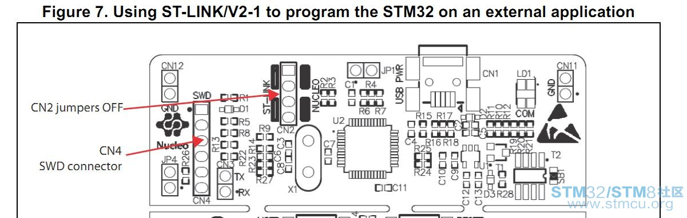
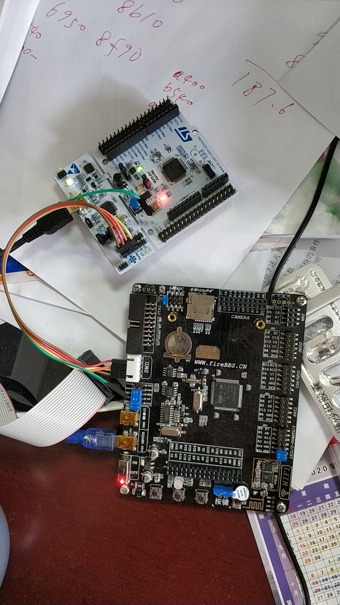

# 使用 VS2019 Community 在 Win10 下进行 STM32 嵌入式编程

作者：武汉大学计算机学院 胡继承

时间：2019年11月18日

----

多年来由于经济因素，中国的大学生及广大的小公司通常使用盗版软件进行嵌入式编程。在开源风暴的席卷下，时至今日终于有机会使用开源工具链在 Win10 下进行嵌入式编程，而且方便性及稳定性完全不亚于商业软件。想想商用数据库软件在中华日益没落的历史，可以想象嵌入式开发的开源时代已经到来，该花点时间捋捋了。本文以 STM32 系列的 ARM 芯片嵌入式开发为例子来展现开源嵌入式开发的流程，如果使用 mbed 的话也容易类推到其它 ARM 芯片的嵌入式开发。

微软在 VS2017 中便引入了嵌入式编程，经过几年的发展已经越来越成熟了。本文介绍如何使用 VS2019 社区版来进行嵌入式编程。使用 VS code 也能完成该项工作，配置方法基本类似。

基本步骤如下：
1. 使用开源工具生成框架程序
2. 使用 VS 2019 Community 进行编码和编译
3. 使用 ST-LINK/V2-1 将程序下载到电路板
4. 使用 VS 2019 Community 调试程序

按照基本步骤下文逐一进行演示。硬件的话，买个最便宜的 NUCLEOF411RE 开发板就行，淘宝上不到120元。而且其自带的仿真器日后还可用于其它芯片的嵌入式开发，也就是说你不要额外再花钱买仿真器了。

## 1. 使用开源工具生成框架程序

如果采用操作系统的话选择众多，这里我们选择名气比较大的两个工具进行介绍：
1. STM32CubeMX
2. mbed

### 1.1 STM32CubeMX

首先去官网注册并下载
[STM32CubeMX](https://www.st.com/content/st_com/en/products/development-tools/software-development-tools/stm32-software-development-tools/stm32-configurators-and-code-generators/stm32cubemx.html)
，有些慢，需要有耐心。

使用的库有两种，一是所谓的硬件抽象层HAL库(Hardware Abstraction Layer), 另一个是所谓的 LL 库（Low Layer)。两种都支持 STM32 全系列的芯片。软件方向的爱好者使用HAL会比较方便，要求的硬件知识更少。硬件方向的可能更喜欢LL。

### 1.2 mbed

## 2. 使用 VS 2019 Community 进行编码和编译

[GNU Arm Embedded Toolchain Version 8-2019-q3-updateReleased: July 10, 2019](https://developer.arm.com/tools-and-software/open-source-software/developer-tools/gnu-toolchain/gnu-rm/downloads)

选择下载 **gcc-arm-none-eabi-8-2019-q3-update-win32.zip**

Windows 32-bit ZIP package

MD5: 5fa382a547abe0b0d5c0a6e9eaa75c7b

下载后，安装或者解压即可。目录下有一个bin的文件夹，可以看到有下列文件：

## 3. 使用 ST-LINK/V2-1 将程序下载到电路板

### 3.1 ST-LINK/V2-1引脚定义

**ST-LINK/V2-1 只能调试 STM32 系列芯片**
       
| foot | CN4 | description |
| :---: | --- | --- |
| 1 | VDD_TARGET | target VDD |
| 2 | **SWCLK SWD** | clock |
| 3 | GND | ground |
| 4 | **SWDIO SWD** | data I/O |
| 5 | NRST | target MCU RESET |
| 6 | SWO | reserved |

**调试外接电路板时需要将 CN2 两个跳线悬空**

如果不接1、3脚，会对目标MCU板的电源造成很剧烈的干扰。

## 4. 使用 VS 2019 Community 调试程序

